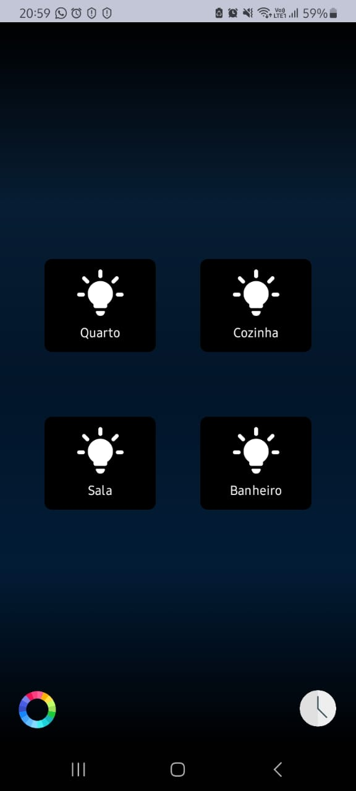
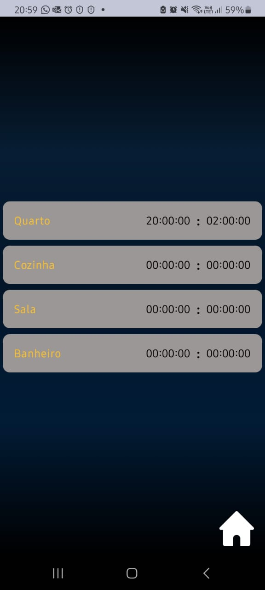

# Lampadas Inteligentes

Lampadas Inteligentes  é um aplicativo desenvolvido em Kotlin utilizando Jetpack Compose que permite o controle total das luzes da sua casa. Com Lampadas Inteligentes, você pode ligar e desligar as luzes, agendar horários para controle automático e até mesmo alterar a cor das luzes RGB para criar o ambiente perfeito para qualquer ocasião.

## Funcionalidades Principais

- **Controle de Lâmpadas:** Ligue e desligue as luzes da sua casa diretamente pelo aplicativo.
- **Agendamento de Horários:** Programe horários específicos para ligar e desligar as luzes automaticamente.
- **Alteração de Cores RGB:** Customize a cor das suas lâmpadas RGB para criar diferentes ambientes e atmosferas.
- **Interface Intuitiva:** Desenvolvido com Jetpack Compose, oferece uma interface de usuário moderna e responsiva.

## Capturas de Tela

### Tela de Controle de Lâmpadas


### Tela de Agendamento


### Tela de Alteração de Cores RGB


## Tecnologias Utilizadas

- **Linguagem de Programação:** Kotlin
- **Framework de UI:** Jetpack Compose
- **Controle de Hardware:** Integração com sistemas de iluminação inteligentes

## Pré-requisitos

- Dispositivo Android (API 21+)
- Conexão com o sistema de iluminação inteligente compatível

## Instalação

1. Clone o repositório:

   ```bash
   git clone https://github.com/BrunoHiago/LampadasInteligentes

   ```
2. Abra o projeto no Android Studio.

3. Compile e execute o aplicativo no dispositivo Android.

## Como Usar
- Configure a conexão com o sistema de iluminação inteligente da sua casa.
- Utilize a interface do aplicativo para controlar as luzes, agendar horários e alterar as cores RGB.
- Desfrute do controle total da iluminação da sua casa na palma da sua mão.
  
## Autores
- [Bruno Hiago Xavier ](https://github.com/BrunoHiago)
- [Iasmin Pieraço Rodrigues ](https://github.com/IasminPieraco)
- [José Ferreira Arantes Lopes ](https://github.com/JoseArantes83)
- [Peterson Leandro G. Batista ](https://github.com/zSkiluu)
